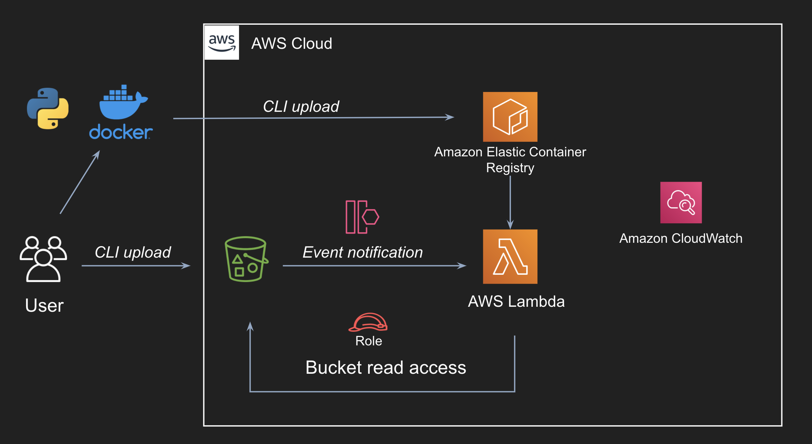

# Containers on Lambda

## Steps
- `lambda.py` - Contains code for reading file from `S3`

- Build the `Dockerfile` and Tag the image
```
docker build . -t python-containerize:v1
docker tag python-containerize:v1 <account_id>.dkr.ecr.us-east-1.amazonaws.com/python-containerize:v1
```

- Create ECR repository and Push the image
```
aws ecr create-repository --repository-name python-containerize --image-scanning-configuration scanOnPush=true --region us-east-1
aws ecr get-login-password --region us-east-1 | docker login --username AWS --password-stdin <account_id>.dkr.ecr.us-east-1.amazonaws.com
docker push <account_id>.dkr.ecr.us-east-1.amazonaws.com/python-containerize:v1
```
- Upload the file to S3 bucket

`aws s3 cp tp-data.txt s3://tp-data-bucket/tp-data.txt`

## Architecture

